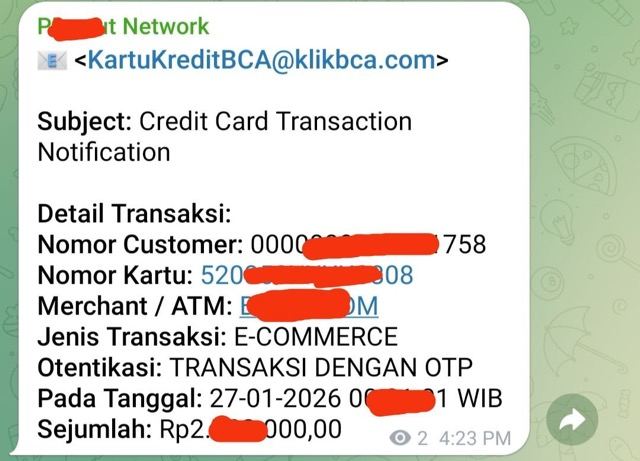

# Email Parser Worker

A Cloudflare Worker that parses incoming emails **Transaction Notification from BCA** using `postal-mime` and forwards transaction details to Telegram.

## Features
- Parses extracting:
```plain
Nomor Customer
Nomor Kartu
Merchant / ATM
Jenis Transaksi
Otentikasi
Pada Tanggal
Sejumlah
```
- Sends formatted notifications to Telegram.
- Supports handling forwarded emails (extracts original details).

```json
--- Extracted Data ---
{
  "nomorCustomer": "000000001XXXXX58",
  "nomorKartu": "520XXXXXXXXX08",
  "merchant": "BLXXXX.COM",
  "jenisTransaksi": "E-COMMERCE",
  "otentikasi": "TRANSAKSI DENGAN OTP",
  "padaTanggal": "27-01-2026 00:XX:01 WIB",
  "sejumlah": "Rp2.XXX.000,00"
}
```



## Setup

1.  **Install Dependencies**:
    ```bash
    npm install
    ```

2.  **Local Testing**:
    You can test with a local `.eml` file:
    ```bash
    npm run test:local
    ```
    Ensure you have `Credit Card Transaction Notification.eml` or `Fwd_ Credit Card Transaction Notification.eml` in the root.

3.  **Secrets Configuration**:
    For local development, create a `.dev.vars` file:
    ```ini
    TELEGRAM_BOT_TOKEN="your_token"
    TELEGRAM_CHAT_ID="your_chat_id"
    ```

## Deployment

1.  **Authenticate**:
    ```bash
    npx wrangler login
    ```

2.  **Set Secrets** (Production):
    Run the following commands and enter values when prompted:
    ```bash
    npx wrangler secret put TELEGRAM_BOT_TOKEN
    npx wrangler secret put TELEGRAM_CHAT_ID
    ```
    *Note: You can also set these in the Cloudflare Dashboard under Worker > Settings > Variables and Secrets.*

3.  **Deploy**:
    ```bash
    npm run deploy
    ```

## Project Structure
- `src/index.ts`: Main worker logic.
- `scripts/test-local.ts`: Local testing script.
