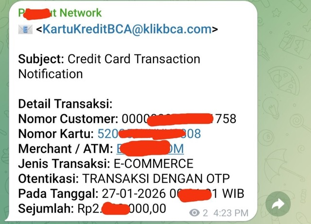

# Email Parser Worker

A Cloudflare Worker that parses incoming emails **Transaction Notification from BCA** using `postal-mime` and forwards transaction details to Telegram and WhatsApp (via WAHA).

## Features
- Parses extracting:
```plain
Nomor Customer
Nomor Kartu
Merchant / ATM
Jenis Transaksi
Otentikasi
Pada Tanggal
Sejumlah
```
- Sends formatted notifications to Telegram.
- Forwards the same notification to a WhatsApp group via WAHA.
- Supports Telegram forum topic threads via optional `TELEGRAM_TOPIC_ID`.
- Supports handling forwarded emails (extracts original details).

```json
--- Extracted Data ---
{
  "nomorCustomer": "000000001XXXXX58",
  "nomorKartu": "520XXXXXXXXX08",
  "merchant": "BLXXXX.COM",
  "jenisTransaksi": "E-COMMERCE",
  "otentikasi": "TRANSAKSI DENGAN OTP",
  "padaTanggal": "27-01-2026 00:XX:01 WIB",
  "sejumlah": "Rp2.XXX.000,00"
}
```



## Setup

1.  **Install Dependencies**:
    ```bash
    npm install
    ```

2.  **Local Testing**:
    You can test with a local `.eml` file:
    ```bash
    npm run test:local
    ```
    Ensure you have `Credit Card Transaction Notification.eml` or `Fwd_ Credit Card Transaction Notification.eml` in the root.

3.  **Secrets Configuration**:
    For local development, create a `.dev.vars` file:
    ```ini
    TELEGRAM_BOT_TOKEN="your_token"
    TELEGRAM_CHAT_ID="your_chat_id"
    TELEGRAM_TOPIC_ID="your_topic_id"
    WA_API_URL="https://your-waha-server"
    WA_API_KEY="your_waha_api_key"
    WA_GROUP_ID="your_whatsapp_group_id"
    WA_SESSION="default"  # optional, defaults to "default"
    ```

    `TELEGRAM_TOPIC_ID` is **optional**. Set it only if your Telegram group is a forum supergroup with Topics enabled and you want messages sent to a specific topic.

    **How to get the Topic ID:**
    - Open the topic in Telegram Web/Desktop. The URL looks like `https://t.me/c/1234567890/42` — the topic id is the last number (`42`).
    - Or use a bot/helper such as `@RawDataBot` in the target topic.

    Leave it empty or unset to send to the group's default (General) topic.

## Deployment

1.  **Authenticate**:
    ```bash
    npx wrangler login
    ```

2.  **Set Secrets** (Production):
    Run the following commands and enter values when prompted:
    ```bash
    npx wrangler secret put TELEGRAM_BOT_TOKEN
    npx wrangler secret put TELEGRAM_CHAT_ID
    # Optional: only for forum supergroups with Topics
    npx wrangler secret put TELEGRAM_TOPIC_ID
    npx wrangler secret put WA_API_URL
    npx wrangler secret put WA_API_KEY
    npx wrangler secret put WA_GROUP_ID
    npx wrangler secret put WA_SESSION  # optional
    ```
    *Note: You can also set these in the Cloudflare Dashboard under Worker > Settings > Variables and Secrets.*

3.  **Deploy**:
    ```bash
    npm run deploy
    ```

## Project Structure
- `src/index.ts`: Main worker logic.
- `scripts/test-local.ts`: Local testing script.
